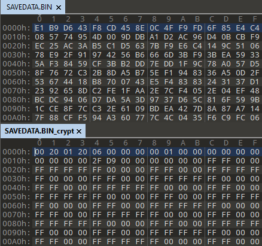
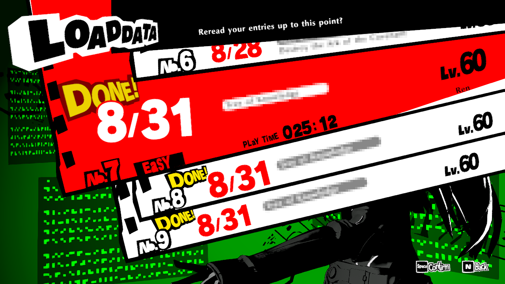

# Persona 5 Strikers PC Save Utility

A simple save decryption, encryption and conversion utility for P5S PC.

## Decrypting/Encrypting PC Saves

- Locate `SAVEDATA.BIN` under `%APPDATA%\SEGA\Steam\P5S\<account_id>\`

- Get the **SteamID64** associated with the account under which the save was created

  The last segment of **SteamID3** will also work (`[U:1:<last_segment>]`)

  The name of the directory containing `SAVEDATA.BIN` (`<account_id>`) will also work

- To decrypt or encrypt the save:

  `p5spc.saveutil.exe crypt --input </path/to/SAVEDATA.BIN> --steam <SteamID64>`

_Example - encrypted save above, decrypted below_:

## Converting Saves

### Supported Save Formats

- `Switch_JP` / `Switch_EN`
- `PC` - Saves must be [decrypted](#decrypting/encrypting-pc-saves) before converting
- `PS4_JP` - Saves must be decrypted before converting (e.g. using homebrew)

### Usage

- Get a save to convert:
  - Decrypt a PC save (`SAVEDATA.BIN`) or
  - Dump a save from Switch (`savedata`) or
  - Dump a **decrypted** save from PS4 (`APP.BIN`)

- The source format will be auto-detected

- To convert:

  `p5spc.saveutil.exe convert --input <path/to/savedata> --target <target_format>`

  With `<target_format>` being any of the formats described [above](#supported-save-formats)

_Example - Switch JP save converted to PC save_:

